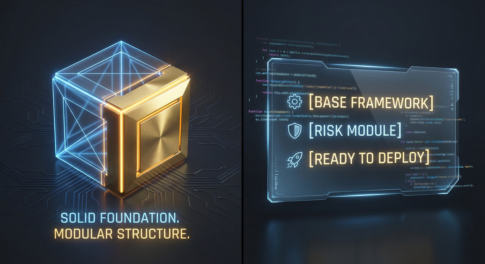

# EA Template Project

## Overview
這是一個 MQL5 Expert Advisor 的標準通用模板。
旨在提供一個清晰、模組化的開發起點。

## Project Structure
- **EA_Template.mq5**: 程式主入口 (Main Entry Point)。
- **concept/**: 策略邏輯與概念文件。
- **para_set/**: 參數設定檔 (.set)。
- **releases/**: 編譯後的執行檔 (.ex5)。
- **prompts.md**: Copilot 常用指令庫。

## Getting Started
1. 修改 \concept/idea.md\ 定義策略邏輯。
2. 在 \EA_Template.mq5\ 中實現核心邏輯。
3. 使用 \prompts.md\ 中的輔助指令進行開發。
